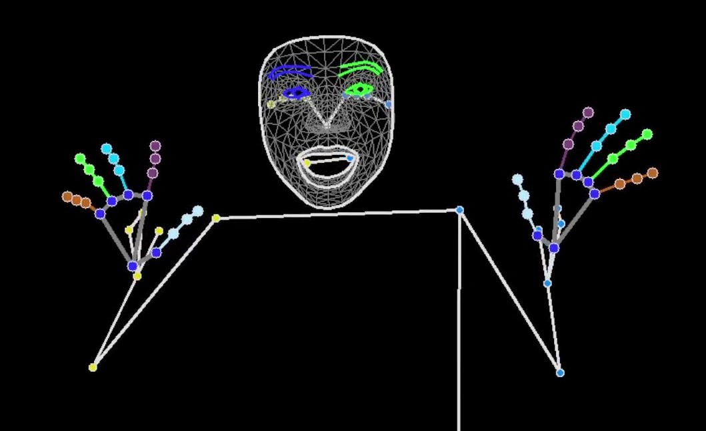

# MediaPipe Inferencer

[日本語版はこちら](README_jp.md)

This software performs real-time pose estimation using MediaPipe.Task.Vision from camera input and sends the results via UDP. Designed as a module for larger applications, the inference results are transmitted to the requesting application through inter-process communication (UDP).



## Features

- Pose, Hand, and Face estimation using MediaPipe Pose, Hand, and Face.
- UDP transmission of inference results.
  - The message type is defined by [HumanLandmarks](https://github.com/ec-k/HumanLandmarks).

## Uniqueness

There is no particular uniqueness to this project.

## Operating Environment

- Windows 11: Confirmed to work.
- Others: Unconfirmed.

## Requirements

This project uses [uv](https://github.com/astral-sh/uv). Please ensure uv is installed.

## Usage

Follow these steps to run the project:

1.  **Install Dependencies:**

    ```bash
    uv sync
    ```

2.  **Import MediaPipe Models:**

    Download the models used for inference from the [MediaPipe page](https://ai.google.dev/edge/mediapipe/solutions/guide) and place them under `models/`.

    Alternatively, run `download_models.ps1`.

3.  **Run Script:**
    Execute one of the following scripts:

    - `src/inference_by_mmap.py`:
      Reads images written to shared memory and performs pose estimation. This is intended for integration with Kinect, and by default, MediaPipe Pose estimation is not performed. Add it if needed.
    - `src/inference_by_webcam.py`:
      Accesses a camera connected to the PC and performs pose estimation. This is suitable for completing pose estimation solely with MediaPipe.
