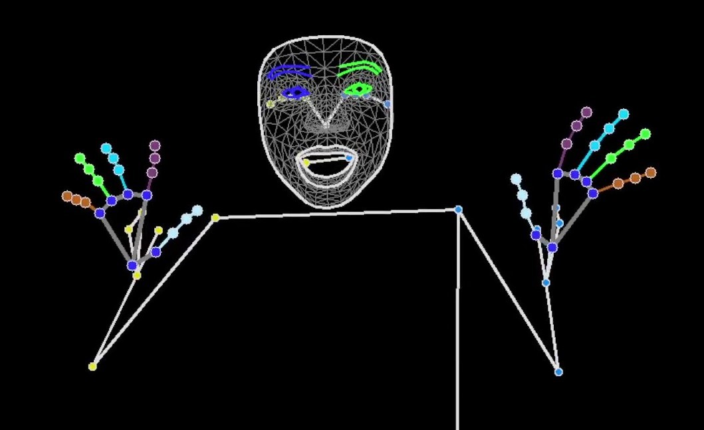

# MediaPipe Inferencer

このソフトウェアは，カメラから取得した映像を MediaPipe.Task.Vision を用いてリアルタイムに姿勢推定し，その結果を UDP で外部に送信します．より大規模なアプリケーションのモジュールとして設計されており，推定結果はプロセス間通信（UDP）を通じて要求元のアプリケーションに送信されます．



## 機能

- MediaPipe Pose, Hand, Face による姿勢推定
- 推定結果の UDP 送信
  - メッセージの型は[HumanLandmarks](https://github.com/ec-k/HumanLandmarks)で定義されます．

## 独自性

特筆すべき独自性はありません．

## 動作環境

- Windows 11: 動作確認済み
- その他: 未確認

## 必要なもの

このプロジェクトは[uv](https://github.com/astral-sh/uv)を利用しています．uv がインストールされていることを確認してください．

## 使用方法

以下の手順で実行できます．

1.  **依存関係のインストール:**

    ```bash
    uv sync
    ```

2.  **スクリプトの実行:**
    以下のいずれかのスクリプトを実行してください．

    - `src/inference_by_mmap.py`:
      共有メモリに書き込まれた画像を読み取り，姿勢推定を行います．Kinect との連携を想定しており，デフォルトでは MediaPipe Pose の推定は行いません．必要に応じて追加してください．
    - `src/inference_by_webcam.py`:
      PC に接続されたカメラにアクセスし，姿勢推定を行います．MediaPipe のみで姿勢推定を完結させる場合に適しています．
